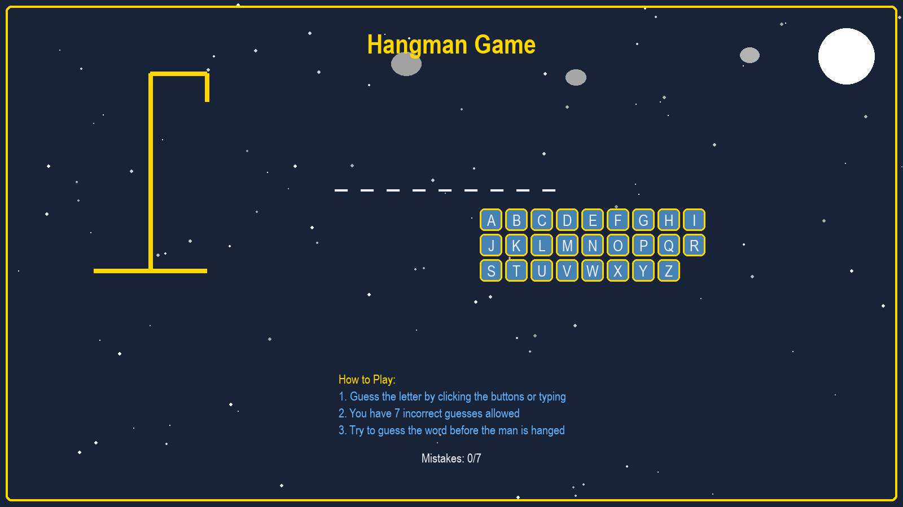
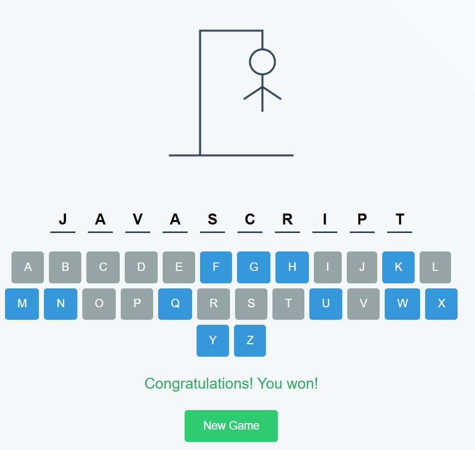

# Hangman Game - Modular Python Implementation

A fully functional Hangman game built with Pygame, organized into 4 modular files for better code organization and maintainability.

## 📸 Screenshots

### Python Desktop Version

*The original Python/Pygame implementation featuring full-screen mode, animated background with stars and clouds, and the complete modular architecture.*

### Web Browser Version

*The web-optimized version running in browsers, featuring responsive design and cross-platform compatibility.*

**Live Demo**: [Play the game online](https://sadikshyabashyal.github.io/Hangman-Game/)

## 🎮 Features

- **Full Screen Mode**: Runs in fullscreen for immersive gameplay
- **Dynamic Animations**: Animated stars and clouds in the background
- **Dual Input**: Play with mouse clicks or keyboard typing
- **Visual Feedback**: Color-coded messages and button states
- **Game State Management**: Proper win/lose detection and game reset
- **Modular Architecture**: Clean separation of concerns

## 📁 File Structure

### 1. `constants.py`
**Purpose**: Contains all game constants and configuration
- Color definitions
- Game word list
- Game settings (max mistakes, message display time)

### 2. `ui_components.py`
**Purpose**: All UI elements and rendering functions
- `FontManager`: Manages all game fonts
- `HangmanRenderer`: Draws the hangman figure
- `Button`: Individual clickable letter buttons
- `ButtonManager`: Manages all A-Z letter buttons
- `BackgroundRenderer`: Animated background (stars, clouds, moon)
- `GameRenderer`: Main rendering coordinator

### 3. `game_logic.py`
**Purpose**: Core game mechanics and state management
- `GameLogic`: Handles word selection, letter guessing, win/lose conditions
- `InputHandler`: Processes keyboard and mouse input events

### 4. `main.py`
**Purpose**: Main game coordinator and entry point
- `Game`: Main game class that coordinates all components
- Initializes Pygame and all game components
- Runs the main game loop

## 🚀 How to Run

1. **Install Dependencies**:
   ```bash
   pip install pygame
   ```

2. **Run the Game**:
   ```bash
   python main.py
   ```

3. **Testing All Components Together**:
   If you want to test all components in a single file, see `test.py` in the `Testing_phase` directory:
   ```bash
   python Testing_phase/test.py
   ```

## 🎯 How to Play

- **Mouse**: Click letter buttons to guess
- **Keyboard**: Type any letter (A-Z) to guess
- **Controls**:
  - `SPACE`: Restart game (when won/lost)
  - `ESC`: Exit game
  - `X` button: Close window

## 🏗️ Architecture Benefits

### **Modularity**
- Each file has a single responsibility
- Easy to modify individual components
- Clear separation of concerns

### **Maintainability**
- Well-documented code with docstrings
- Consistent naming conventions
- Logical file organization

### **Extensibility**
- Easy to add new features
- Simple to modify game settings
- Reusable components

### **Readability**
- Clear class and function names
- Comprehensive comments
- Logical code flow

## 🔧 Customization

### **Adding New Words**
Edit `constants.py` and add words to the `WORDS` list.

### **Changing Colors**
Modify color constants in `constants.py`.

### **Adjusting Game Settings**
Change `MAX_MISTAKES` or `MESSAGE_DISPLAY_TIME` in `constants.py`.

### **Modifying Animations**
Edit the `BackgroundRenderer.draw_decorations()` method in `ui_components.py`.

## 🎨 Visual Features

- **Animated Background**: Moving stars and clouds
- **Dynamic Hangman**: Progressive body part drawing
- **Interactive Buttons**: Hover effects and state changes
- **Color-coded Feedback**: Green for correct, red for wrong
- **Smooth Animations**: 60 FPS gameplay

## 📝 Code Quality

- **Documentation**: Comprehensive docstrings for all classes and methods
- **Comments**: Inline comments explaining complex logic
- **Type Hints**: Clear parameter and return type documentation
- **Error Handling**: Robust input validation and state management

## 🧪 Testing

For testing all components together in a single file, use the `test.py` file located in the `Testing_phase` directory. This file contains all the modular components combined into one file for easier testing and debugging.

This modular structure makes the code easy to understand, maintain, and extend while providing a complete, feature-rich Hangman game experience.

## 📸 Screenshot Feature

The `Screenshot-Feature` directory contains the same modular Hangman game code but with an additional screenshot functionality. This version includes:

- **Built-in Screenshot Capture**: Press `F12` during gameplay to capture a screenshot
- **Automatic Screenshot Directory**: Screenshots are automatically saved to a `screenshots` folder
- **Timestamped Filenames**: Each screenshot is saved with a unique timestamp
- **Same Core Gameplay**: All original features and functionality remain unchanged

The screenshot feature is implemented in the main game loop and allows players to capture memorable moments or document their gameplay. Screenshots are saved in PNG format and can be used for documentation, sharing, or creating tutorials.

To use the screenshot feature:
1. Run the game normally
2. During gameplay, press `F12` to capture a screenshot
3. Check the `screenshots` folder for your captured images

## 💭 Discussion

### **Desktop vs Web Implementation**

The Hangman game has been successfully implemented in two different environments, each with its own advantages:

**Python Desktop Version:**
- **Full-screen immersive experience** with animated backgrounds
- **High-performance graphics** using Pygame's optimized rendering
- **Modular architecture** for easy maintenance and extension
- **Rich visual effects** including dynamic animations and smooth transitions
- **Native system integration** with keyboard and mouse input

**Web Browser Version:**
- **Cross-platform accessibility** - runs on any device with a web browser
- **No installation required** - instant play capability
- **Responsive design** that adapts to different screen sizes
- **Easy sharing** via simple URL links
- **Modern web technologies** using HTML5 Canvas and JavaScript

### **Technical Comparison**

| Feature | Python Desktop | Web Browser |
|---------|----------------|-------------|
| **Performance** | High (native) | Good (WebAssembly) |
| **Graphics** | Full-screen, animated | Responsive, optimized |
| **Input** | Keyboard + Mouse | Keyboard + Mouse + Touch |
| **Deployment** | Local installation | Cloud-hosted |
| **Updates** | Manual download | Automatic |
| **Platform** | Windows/Mac/Linux | Any browser |

### **Development Approach**

The modular design of the Python version made it relatively straightforward to create a web equivalent. The core game logic was preserved while adapting the rendering system to work with HTML5 Canvas. This demonstrates the value of clean architecture and separation of concerns in software development.

Both versions maintain the same engaging gameplay experience while leveraging the strengths of their respective platforms. 